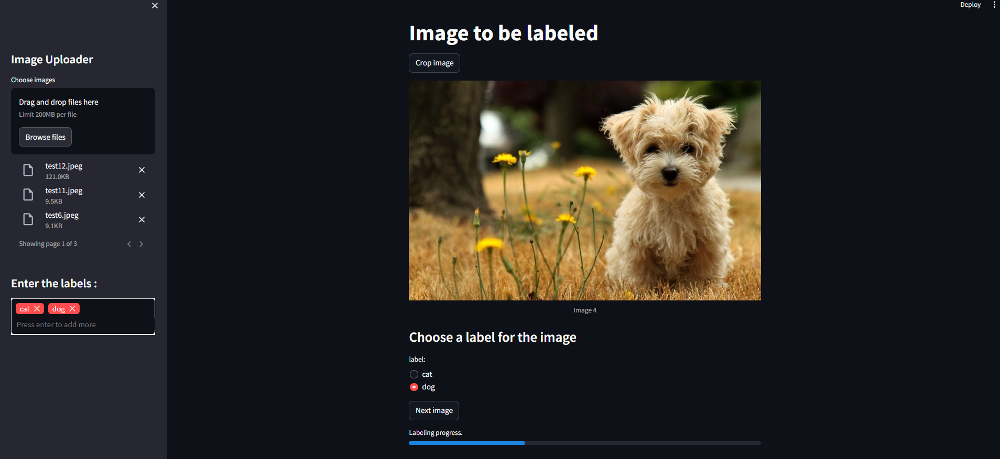

# Image Labeler App

Efficiently label images with ease using this Streamlit app, offering image cropping and a seamless labeling experience.




## Features

  - Intuitive interface: Navigate effortlessly with a user-friendly design.
  - Image uploads: Upload multiple images simultaneously for efficient labeling.
  - Customizable labels: Define the labels that suit your specific needs.
  - Image cropping: Precisely focus on essential regions by cropping images for enhanced accuracy.
  - Real-time updates (optional): Observe changes instantly as you crop.
  - Label assignment: Assign appropriate labels to images with a straightforward radio button selection.
  - Progress tracking: Stay informed of your progress with a clear progress bar.
  - Labeled image storage: Labeled images are automatically saved within organized folders based on their assigned labels, ensuring efficient retrieval.

## Installation:

1. Clone the repository:
```Bash
git clone https://github.com/MatheussAlvess/labeler-app.git
```

2. Install dependencies:

```Bash
cd image-labeler-app
pip install -r requirements.txt
```

## Usage:

1. Run the app:
```Bash
streamlit run app.py
```
2. Access the app in your web browser.
3. Upload images: Use the sidebar to select and upload your images.
4. Enter labels: Provide a comma-separated list of labels in the sidebar.
5. Crop images (optional): Click "Crop image" to activate cropping mode.
6. Assign labels: Select the appropriate label for each image.
7. Progress through images: Use the "Next image" button to move between images.
8. View labeled images: Labeled images are saved within the "images" folder, organized by label.

## Additional Information:

 - Built with: Streamlit, Pillow, streamlit-cropper, streamlit-tags
   
Explore the app and start labeling your images efficiently!
